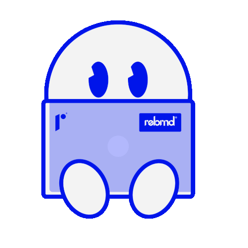

  

#

<h3 align="left">Desenvolvedor FullStack</h3>

Estudante de Ciência da Computação pela Universidade Federal do Espírito Santo (UFES) e Assessor de Desenvolvimento na Empresa Júnior Adapti - Soluções Web. Atualmente trabalho com React e Laravel e estudo Vue.js.
Estou em constante aprendizado, aprimorando minhas habilidades e buscando novos desafios. Minha curiosidade e dedicação me impulsionam a buscar maneiras inovadoras de resolver problemas.
  
#

<h3 align="left">Contato</h3>

<h3 align="left">Stacks</h3>

  
  
  
  
  
  
  
  
  
  
  
  
  
  
  
  
  

#

  <h3>GitHub Stats</h3>
   
  

  

